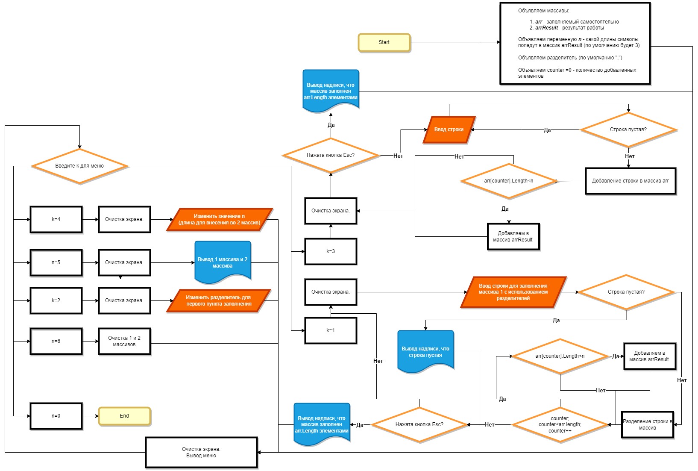

#   * Итоговая работа за первый семестр * #

## Задание ##

1. Создать репозиторий на GitHub
2. Нарисовать блок-схему алгоритма (можно обойтись блок-схемой основной содержательной части, если вы выделяете её в отдельный метод)
3. Снабдить репозиторий оформленным текстовым описанием решения (файл README.md)
4. Написать программу, решающую поставленную задачу
5. Использовать контроль версий в работе над этим небольшим проектом (не должно быть так, что всё залито одним коммитом, как минимум этапы 2, 3, и 4 должны быть расположены в разных коммитах)

*Задача* Написать программу, которая из имеющегося массива строк формирует новый массив из строк, длина которых меньше, либо равна 3 символам. Первоначальный массив можно ввести с клавиатуры, либо задать на старте выполнения алгоритма. При решении не рекомендуется пользоваться коллекциями, лучше обойтись исключительно массивами.

## Ход выполнения ##

### 1. Репозиторий ###

Был создан репозиторий https://github.com/Orroty/FirstSemesterFinWork

### 2. Блок-схема ###

Создана блок-схема и приложена к документу в 2 экземплярах(картинка и .drawio).

Картинка в файле 

### 4. Программа ###

Создана функции

1. void PrintMainMenu()  - вывод меню в консоль.

2. bool GetOrEscape(out string result)  - ввод строки 
атрибут result - вводимая строка. Передается с модификатором out
возвращает bool - если в конце нажат Enter - вернет true, если Esc - вернет false

3. void AddToArray(ref string[] arr, string value, int counter) - Заполнение массива строк. Если размер массива недостаточен увеличивает размер массива на 1 
 атрибуты
3.1. arr - измеяемый массив. Передается с модификатором ref
3.2. value - строка, добавляемая в массив.
3.3. counter - число - индекс на который добавляется строка в массиве

4. void CleanArray() - отчистка 1 массива и уменьшение counter до 0